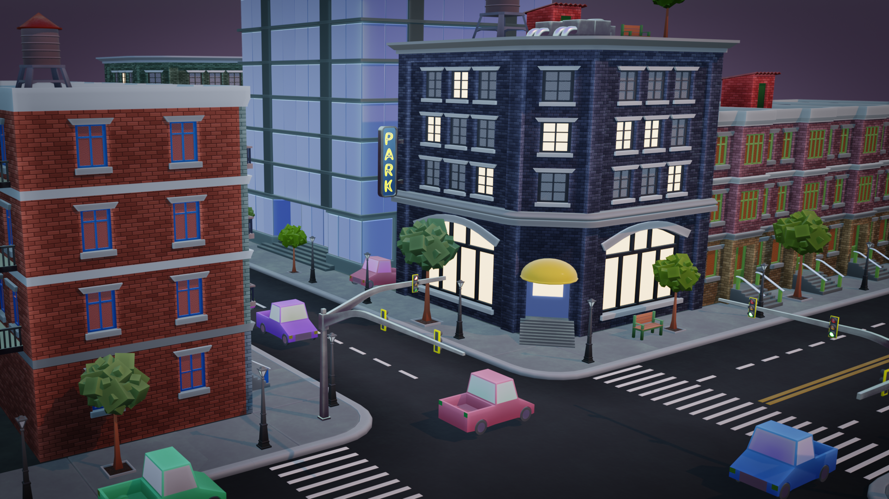

# Coursework for "Cubicity: Creating & Utilizing Asset Libraries With Blender"

This contains the projects used for the course [Cubicity: Creating & Utilizing Asset Libraries With Blender](https://blendermarket.com/products/cubicity-creating-and-utilizing-asset-libraries-with-blender).

The goal of the course was to learn the asset workflow so the actual Art aspects were not a priority.

